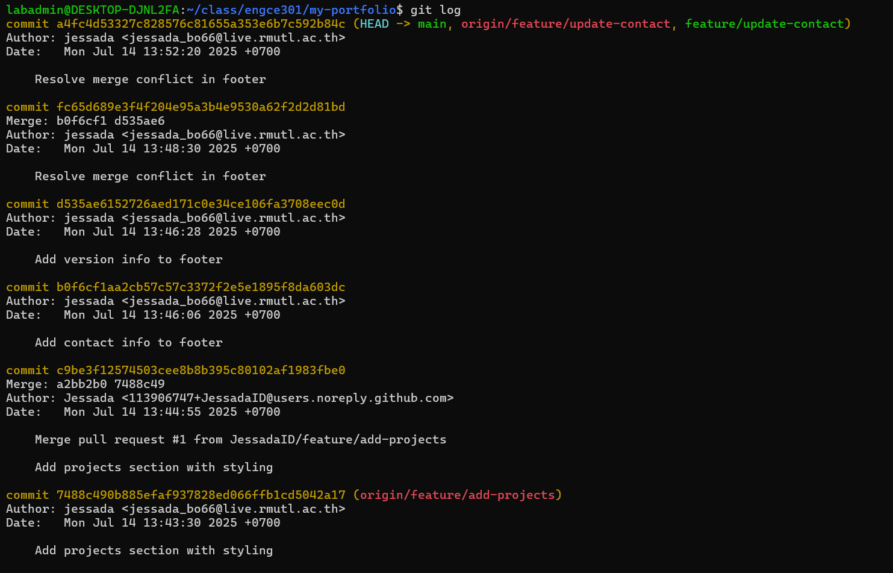
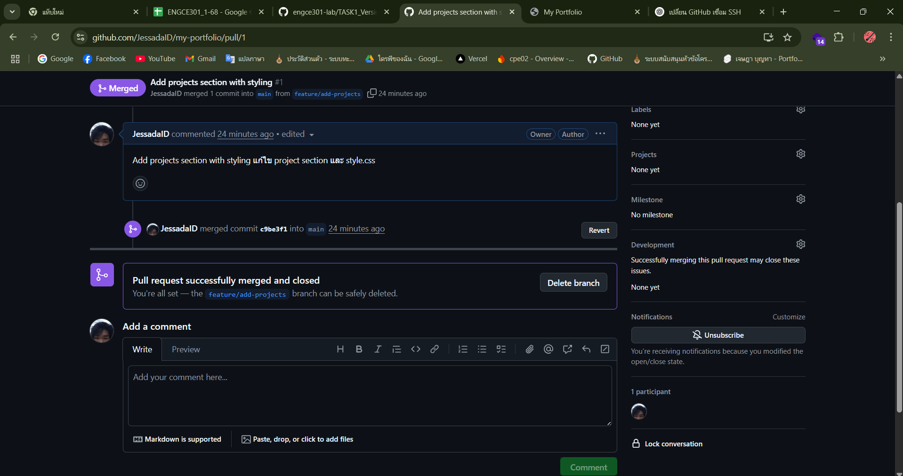

## Task1

1.ลิงก์ GitHub Repository : [Github Link](https://github.com/JessadaID/my-portfolio)

2.Screenshot ของ commit history

3.Screenshot ของ Pull Request ที่สร้าง

4.ไฟล์ index.html และ style.css ที่สมบูรณ์
